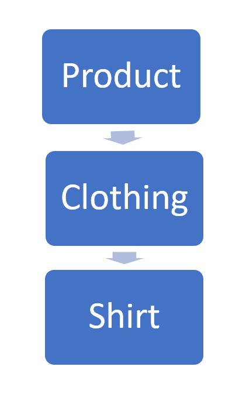

# Saya Raffi Ardhi Naufal NIM 2202495 mengerjakan Latihan Praktikum 2 dalam mata kuliah DPBO untuk keberkahanNya maka saya tidak melakukan kecurangan seperti yang telah dispesifikasikan. Aamiin.

Saya membuat desain kode untuk sistem pendataan baju dari sebuah perusahaan dengan 3 kelas, yaitu Product; Clothing dan Shirt. Masing-masing berisi kode konstruktor, destruktor, getter dan setter. Berikut merupakan urutan pewarisan daripada 3 kelas tersebut : 

